# UnrealAITokenSystem
> Language: [English](README.md), [中文](README-CN.md)

受《DOOM》启发的AI令牌系统，用于管理游戏中的群体战斗。

系统的基本概念来自于id Software 2018年在GDC上的演讲，非常建议前往观看，以便对该系统有一个初步的了解。[Embracing Push Forward Combat in DOOM](https://www.youtube.com/watch?v=2KQNpQD8Ayo)

### 概念引入
AI令牌系统旨在解决的核心问题是：当玩家面对多个敌人时，由于敌人的逻辑和状态彼此独立，其无节制的行动会迅速使玩家陷入困境。解决此问题的关键在于认识到玩家的注意力资源是有限的。在游戏过程中，玩家需要持续地分配这些注意力资源。若游戏能明确标识出当前状态下最需关注的事物，玩家就能更高效地分配注意力，从而更好地应对当下局面。

基于这一认知，审视令牌系统的设计便可发现：AI令牌系统实质是通过管理玩家的注意力资源来控制群体战斗节奏的。该系统引入了“令牌（Token）”概念，其运作遵循以下核心规则：

- 令牌具有类型区分。
- 敌人执行行动的前置条件： 敌人在执行特定行动前，必须向令牌源（通常由玩家控制）申请并获得对应类型的令牌。仅当持有有效令牌时，方可执行该行动。
- 令牌的释放与循环： 令牌在使用后立即归还至令牌源。令牌可设置冷却时间（可选），在冷却结束前无法被再次获取。
- 令牌数量限制： 令牌总量严格受限且可控。

以上特征即为我们描述了一个宏观解决方案，我们实际上并不对每个敌人个体分别进行管理，而是对玩家注意力资源进行管理。在这个系统当中，“令牌”即为对玩家注意力资源的抽象，本质是通过控制稀缺的“令牌”来间接调控整个战场的行为密度与节奏。 敌人争夺令牌的过程，实质上是竞争玩家有限的注意力焦点。当某一类型的令牌被占用时，其他试图发起同类行动的敌人将被迫等待，这在玩家感知层面自然形成了威胁事件的顺序和优先级。

总而言之，系统确保了在任意时刻，能被玩家清晰注意到的关键威胁行动数量是有限的、可控的，且其发生时机受到冷却机制的调节。这种设计巧妙地将复杂的群体敌人行为协调问题，转化为对有限资源（令牌/注意力）的分配与调度问题，极大地简化了设计复杂度，并从根本上防止了因敌人无节制行动而导致的玩家注意力过载。

### 设计需求
1. 我们希望控制在任意时刻中，玩家在群体战中所能遭遇的，压力最大的情况。
2. 当令牌已被全部占用的情况下，我们希望某些特定状态下的敌人能够从优先级低的目标身上抢夺令牌。
3. 我们希望有优先级机制，优先级低的敌人永远无法从优先级高的敌人上抢夺令牌。
4. 我们不希望当一个目标在持有令牌后，真正执行具体行为时，因为令牌被抢夺而行为被打断。
5. 我们不希望令牌老是重复被同一目标占有，我们希望能够调控这一行为。
6. 我们希望这个系统是基于事件驱动的、高性能的系统。
7. 我们希望系统是模块化的，便于拓展的系统。
8. 它应该具有足够直观的可视化工作流程，便于AI设计师测试、迭代。
9. 我们希望令牌存在释放保险机制，用于保护令牌在极端或意外情况下，无法正常被释放。

### 快速上手
1. 创建并打开AITokenData资产

    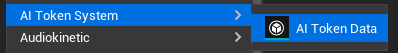

    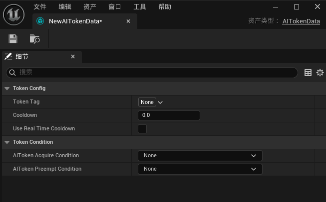

2. 添加Token Tag
    - Token Tag是令牌的类型标识，系统会根据Tag来区分不同类型的令牌。
    - Tag必须是一个有效的FGameplayTag，根Tag必须为“AIToken”，例如“AIToken.Attack”。
    - 你可以自己定义不同的Tag来满足不同的需求。

        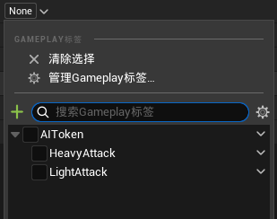

3. 为Token添加获取条件
    - 条件之间可以互相嵌套，可以使用逻辑运算符（AND、OR）来组合条件。
    - 你可以拓展符合自己需求的条件，只需继承UAITokenCondition类并重写Evaluate函数即可，但始终明确条件为静态谓词函数，不应该存在任何状态。
    - 若条件的上下文为Actor，可以选择继承UAITokenCondition_ActorContextBase便利类并重写EvaluateWithActorContext方法，这可以让你更方便的直接获取上下文Actor相关信息。

        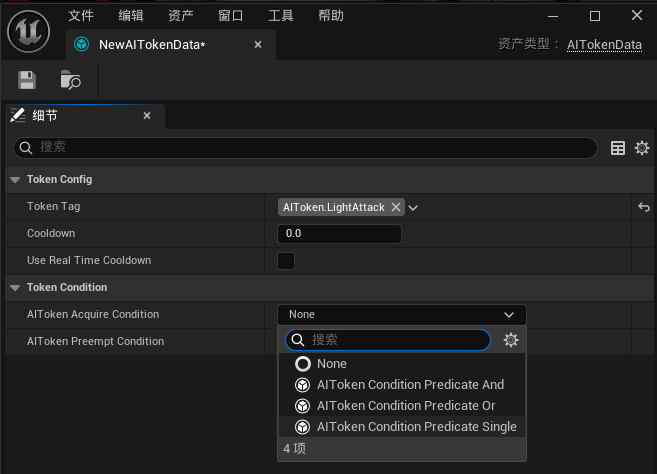

    - 本质上，AIToken的条件解算其实由ConditionPredicate负责，借助虚幻的InstancedStruct系统，可以方便的实现条件Predicate的动态组合。如以下例子，便描述了**只有当敌人处于玩家600cm范围内，且处于玩家前方90°视野范围内时，才有80%的概率允许获取令牌**。

        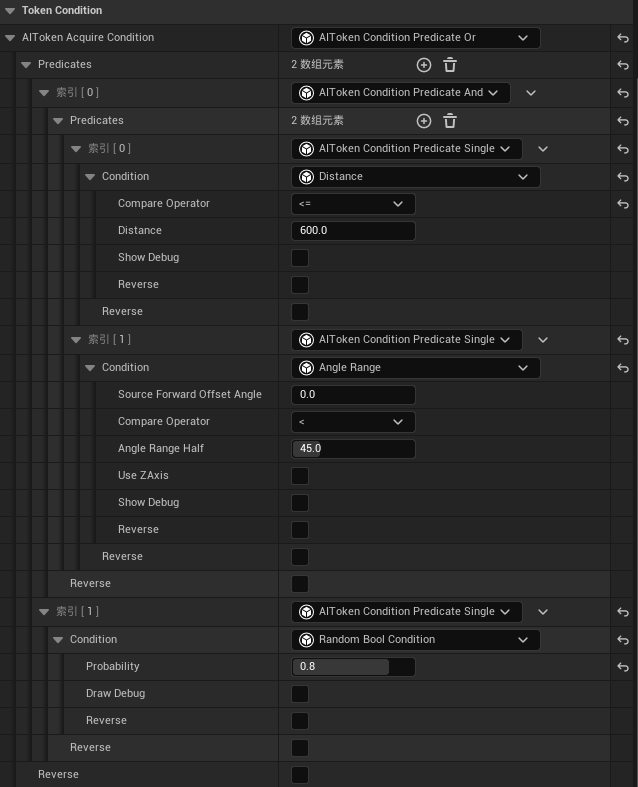

4. 为你的玩家角色添加AITokenSource组件
    - 该组件是令牌的源头，所有令牌都由此组件持有、管理。

        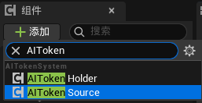

    - 你可以在该组件上配置令牌的数量、种类    
        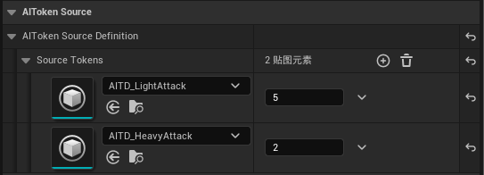

5. 为你的敌人角色添加AITokenHolder组件
    - 该组件是令牌的持有者，负责管理敌人获取和使用令牌的逻辑。
    - 你可以在该组件上配置该Holder是否可以抢夺令牌、抢夺的优先级、方式等。
  
        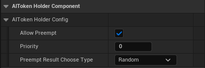

6. 集成到你的AI解决方案中
    - 集成非常容易，只需清楚插件提供以下关键函数：
        
        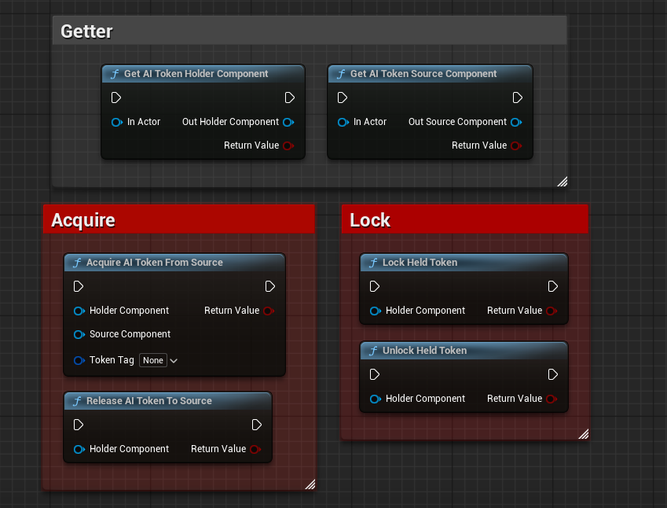

    - 使用系统提供的便捷Getter函数，你可以轻松的从上下文Actor中获取AITokenSource和AITokenHolder组件。
    - 得到AITokenSource和AITokenHolder组件后，你就可以通过它们来管理令牌的获取和使用了。只需明白以下几点：
      - 在你的敌人AI打算执行特定操作时，比如释放某个攻击招式，调用AcquireAITokenFromSource函数来尝试从AITokenSource获取对应类型的令牌。
      - 如果获取成功，敌人可以执行该操作；如果获取失败，敌人将无法执行该操作。
      - 根据你的具体需求，你可以选择是否要锁定当前持有的Token，Token被锁定后，该Token将无法被抢夺，直到调用UnlockAIToken或主动释放当前持有的Token。
      - 当敌人完成操作后，请调用ReleaseAITokenToSource函数将令牌归还给AITokenSource，这样其他敌人就可以重新获取该令牌。

    - 如果你使用行为树，你应该可以很轻易的做到这点，使用自定义Task或Service都可以做到，集成方式很灵活，请自由选择。甚至如果你使用状态树，你可以像我一样，集成到状态输入条件中：

        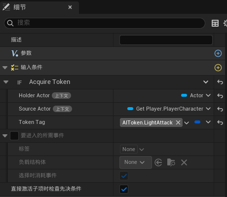

7. 至此，你已经完成了AIToken系统的集成！你可以在游戏中测试令牌的获取和使用逻辑，观察敌人如何根据令牌的状态来调整自己的行为。若你需要使用到AITokenSystem的令牌抢占功能，请继续往下阅读。

### 令牌抢占功能
#### 概述
AIToken系统的抢占功能允许特定状态下的敌人从优先级低的目标身上抢夺令牌。有时候，某些敌人可能需要在特定情况下优先执行某些操作，而这些操作需要令牌支持。抢占功能允许这些敌人在满足特定条件的情况下，从优先级低的敌人身上抢夺令牌。

#### 抢占规则
1. 若Holder将bAllowPreempt字段设置为false，则该Holder无法抢占其他Holder的Token,且同时其他Holder也无法抢占该Holder持有的Token。这其实相当于该Holder已被彻底剥离出Preempt系统当中。
2. 只有通过Token抢夺条件验证的Holder才可以从其他Holder上抢夺Token。
3. 只有处于Held的Token才能被其他Holder抢夺。
4. 优先级低的Holder永远无法从优先级高的Holder上抢夺令牌。
5. 当前同样可以通过Token抢夺条件验证的Holder不会作为被抢夺的对象。
6. 剩下符合条件的Token将可被目标Holder抢夺，若同时存在多个符合条件的Token，将按照目标Token的抢夺结果选择类型进行挑选，目前提供两种选择方式：第一个匹配对象和随机选择。

#### 配置抢占条件
1. 在AITokenData资产中，添加抢占条件。
    - 抢占条件与令牌获取条件类似，但它们是针对抢夺行为的。
    - 你可以定义不同的抢占条件来满足不同的需求。
    - 所用条件类与令牌获取条件相同，都是继承自UAITokenCondition类。

        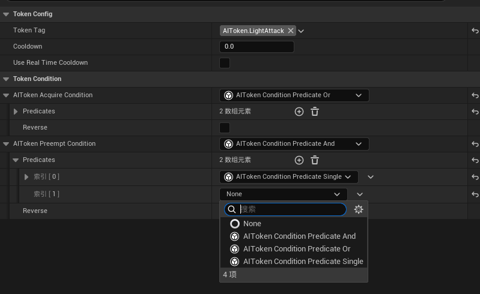

2. 在AITokenHolder组件中，配置抢占相关选项。
    - 你可以设置该Holder是否允许抢占其他Holder的令牌。
    - 你可以设置该Holder的抢占优先级，优先级越高越容易抢夺令牌。
    - 你可以设置抢夺的方式，是选择第一个匹配的令牌还是随机选择。

        

3. 完成配置后，抢占系统将会在你调用AcquireAITokenFromSource函数时自动生效。无需进行额外的集成工作！

### 设计细节
---
#### 令牌的生命周期
对于一个Token，它的生命周期起始是在TokenSource中，它由TokenSource创建，且Outer就是Owner的TokenSource。

Token将记录其当前被哪一个Holder所持有，在任一时刻，一个Token只能被一个Holder持有，一个Holder也只能持有一个Token。这样设计是为了避免使Token逻辑变得过渡复杂，也便于AI设计师使用。

#### 令牌的操作权限
系统明确只有TokenHolder才能对Token进行操作，其他类拿到Token对象之后，只能进行查询操作，而不能对Token本身进行修改。（TokenHolder是Token的友元类）

#### 令牌获取逻辑图
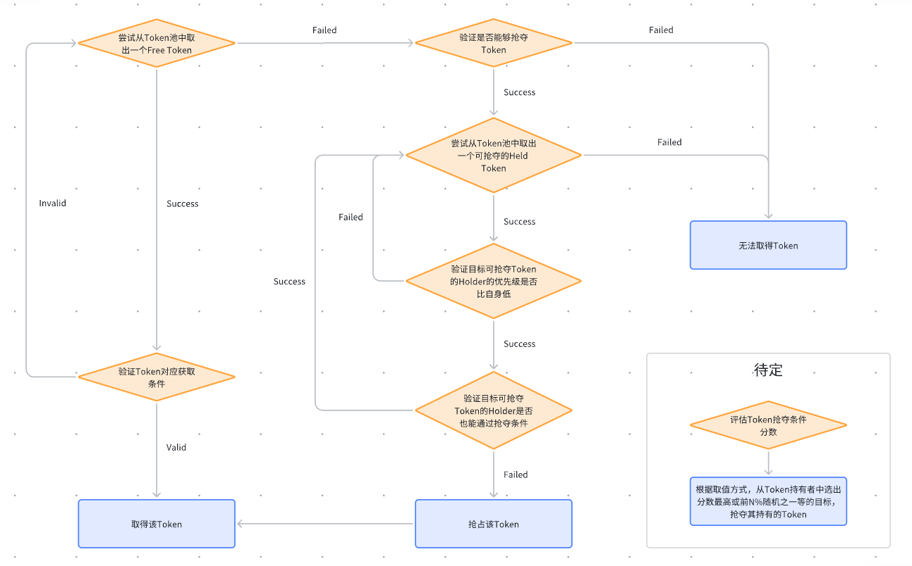

### 关于PR
如果你对该系统有任何改进建议或想法，欢迎提交PR！我们非常欢迎和感谢社区的参与和贡献。
请确保你的PR遵循以下几点：
1. PR应包含清晰的描述，说明你所做的更改和目的。
2. PR应遵循代码风格和规范，以保持代码的一致性和可读性。
3. PR应包含必要的文档更新，以便其他人能够理解你的更改。

### 许可证
本项目采用MIT许可证，详情请查看[LICENSE](LICENSE)文件。