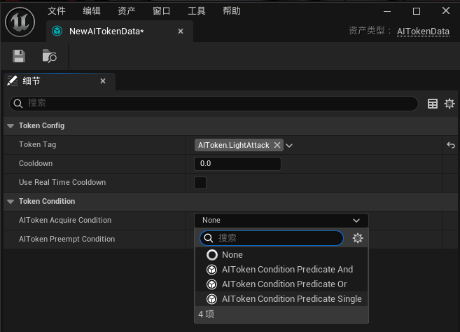
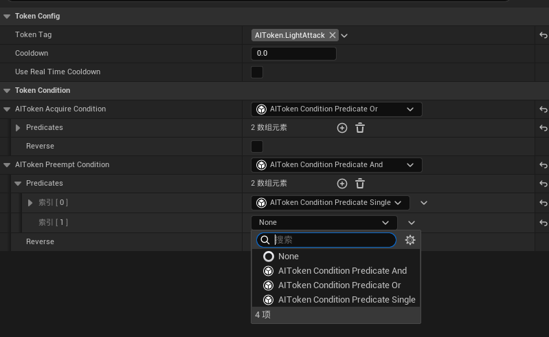
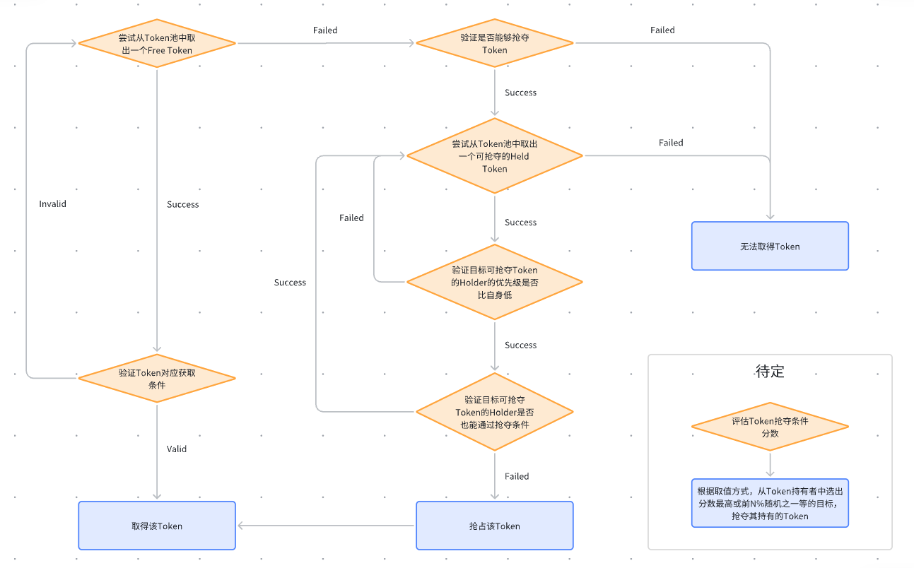

# UnrealAITokenSystem
> Language: [English](README.md), [中文](README-CN.md)

An AI token system inspired by DOOM, designed to manage group combat in games.

The core concept of this system originates from id Software's 2018 GDC talk. It is highly recommended to watch the talk for an initial understanding of the system: [Embracing Push Forward Combat in DOOM](https://www.youtube.com/watch?v=2KQNpQD8Ayo)

### Concept Introduction
The AI token system aims to address a core issue: when players face multiple enemies, the independent logic and states of these enemies can quickly overwhelm the player. The key to solving this problem lies in recognizing that the player's attention resources are limited. During gameplay, players must continuously allocate these resources. If the game can clearly identify the most critical elements to focus on at any given moment, players can allocate their attention more efficiently and better handle the situation.

With this understanding, the design of the token system can be seen as a way to manage group combat pacing by controlling the player's attention resources. The system introduces the concept of "tokens," which operate under the following core rules:

- Tokens are categorized by type.
- Precondition for enemy actions: Before performing specific actions, enemies must request and obtain the corresponding type of token from the token source (usually controlled by the player). Only with a valid token can the action be executed.
- Token release and recycling: Tokens are immediately returned to the token source after use. Tokens can have a cooldown period (optional) during which they cannot be reacquired.
- Token quantity limitation: The total number of tokens is strictly limited and controllable.

These features describe a macro-level solution. Instead of managing each enemy individually, the system manages the player's attention resources. In this system, "tokens" abstract the player's attention resources. By controlling the scarce "tokens," the system indirectly regulates the density and pacing of battlefield actions. The process of enemies competing for tokens essentially represents competition for the player's limited attention focus. When a specific type of token is occupied, other enemies attempting similar actions must wait, naturally forming a sequence and priority of threat events from the player's perspective.

In summary, the system ensures that at any given moment, the number of critical threat actions that can be clearly noticed by the player is limited, controllable, and regulated by a cooldown mechanism. This design cleverly transforms the complex problem of coordinating group enemy behavior into a resource allocation and scheduling problem, significantly simplifying design complexity and fundamentally preventing player attention overload caused by unrestrained enemy actions.

### Design Requirements
1. We aim to control the maximum pressure a player can face during group combat at any given moment.
2. When all tokens are occupied, we want certain enemies in specific states to be able to steal tokens from lower-priority targets.
3. We want a priority mechanism where lower-priority enemies can never steal tokens from higher-priority enemies.
4. We do not want a target's action to be interrupted due to token theft after acquiring a token and starting the action.
5. We want to avoid the same target repeatedly occupying a token and aim to regulate this behavior.
6. We want the system to be event-driven and high-performance.
7. We want the system to be modular and extensible.
8. It should have an intuitive visual workflow to facilitate testing and iteration by AI designers.
9. We want a token release safeguard mechanism to ensure tokens are released properly in extreme or unexpected situations.

### Quick Start
1. Create and open an AITokenData asset.

    

    

2. Add Token Tags
    - Token Tags are type identifiers for tokens. The system uses tags to distinguish between different types of tokens.
    - Tags must be valid FGameplayTags, with the root tag being "AIToken," such as "AIToken.Attack."
    - You can define different tags to meet your specific needs.

        

3. Add acquisition conditions for tokens.
    - Conditions can be nested and combined using logical operators (AND, OR).
    - You can extend conditions to meet your needs by inheriting the UAITokenCondition class and overriding the Evaluate function. Always ensure conditions are static predicate functions without any state.
    - If the condition's context is an Actor, you can inherit the UAITokenCondition_ActorContextBase utility class and override the EvaluateWithActorContext method for easier access to context Actor information.

        

    - Essentially, token condition resolution is handled by ConditionPredicate. Using Unreal's InstancedStruct system, you can dynamically combine condition predicates. For example, the following setup describes a condition where a token can only be acquired with an 80% probability if the enemy is within 600cm of the player and within a 90° field of view in front of the player.

        

4. Add an AITokenSource component to your player character.
    - This component is the source of tokens, managing all tokens.

        

    - You can configure the number and types of tokens on this component.    
        

5. Add an AITokenHolder component to your enemy characters.
    - This component is the token holder, managing the logic for enemies to acquire and use tokens.
    - You can configure whether the holder can steal tokens, its priority, and the method of stealing.

        

6. Integrate into your AI solution.
    - Integration is straightforward. The plugin provides the following key functions:

        

    - Using the system's convenient getter functions, you can easily retrieve AITokenSource and AITokenHolder components from context Actors.
    - Once you have the AITokenSource and AITokenHolder components, you can manage token acquisition and usage through them. Keep the following points in mind:
      - When an enemy AI intends to perform a specific action, such as executing an attack move, call the AcquireAITokenFromSource function to attempt to acquire the corresponding type of token from the AITokenSource.
      - If successful, the enemy can perform the action; otherwise, the action cannot be executed.
      - Depending on your needs, you can choose to lock the currently held token. A locked token cannot be stolen until UnlockAIToken is called or the token is actively released.
      - After completing the action, call the ReleaseAITokenToSource function to return the token to the AITokenSource, allowing other enemies to acquire it.

    - If you use behavior trees, this can be easily achieved with custom Tasks or Services. Integration is flexible, so feel free to choose your approach. If you use State Trees, you can integrate it into state input conditions as shown below:

        

7. At this point, you have completed the integration of the AIToken system! You can test the token acquisition and usage logic in the game and observe how enemies adjust their behavior based on token states. If you need to use the token preemption feature, continue reading.

### Token Preemption Feature
#### Overview
The token preemption feature allows enemies in specific states to steal tokens from lower-priority targets. Sometimes, certain enemies may need to prioritize specific actions that require token support. The preemption feature enables these enemies to steal tokens from lower-priority enemies under certain conditions.

#### Preemption Rules
1. If the Holder sets the bAllowPreempt field to false, it cannot preempt tokens from others, nor can others preempt tokens from it. This effectively removes the Holder from the preemption system.
2. Only Holders that pass the token preemption condition validation can preempt tokens from others.
3. Only tokens in the Held state can be preempted.
4. Lower-priority Holders can never preempt tokens from higher-priority Holders.
5. Holders that also pass the token preemption condition validation will not be considered as preemption targets.
6. Remaining eligible tokens can be preempted by the target Holder. If multiple eligible tokens exist, the selection is based on the preemption result, with two options currently available: first matching token or random selection.

#### Configuring Preemption Conditions
1. Add preemption conditions in the AITokenData asset.
    - Preemption conditions are similar to token acquisition conditions but are specific to preemption behavior.
    - You can define different preemption conditions to meet your needs.
    - The condition classes used are the same as those for token acquisition, inheriting from the UAITokenCondition class.

        

2. Configure preemption-related options in the AITokenHolder component.
    - You can set whether the Holder allows preempting tokens from others.
    - You can set the Holder's preemption priority; higher priority makes it easier to preempt tokens.
    - You can set the preemption method, choosing between the first matching token or random selection.

        

3. Once configured, the preemption system will automatically take effect when you call the AcquireAITokenFromSource function. No additional integration work is required!

### Design Details
---
#### Token Lifecycle
A token's lifecycle begins in the TokenSource, which creates it, with the TokenSource as its Outer.

Tokens record which Holder currently holds them. At any given time, a token can only be held by one Holder, and a Holder can only hold one token. This design avoids overly complex token logic and makes it easier for AI designers to use.

#### Token Operation Permissions
The system explicitly allows only TokenHolders to operate on tokens. Other classes can only query token information and cannot modify the token itself after obtaining it. (TokenHolder is a friend class of Token.)

#### Token Acquisition Logic Diagram

### About PRs
If you have any suggestions or ideas for improving this system, feel free to submit a PR! We greatly welcome and appreciate community participation and contributions.
Please ensure your PR adheres to the following:
1. The PR should include a clear description explaining the changes made and their purpose.
2. The PR should follow coding styles and conventions to maintain code consistency and readability.
3. The PR should include necessary documentation updates to help others understand your changes.

### License
This project is licensed under the MIT License. For details, please refer to the [LICENSE](LICENSE) file.